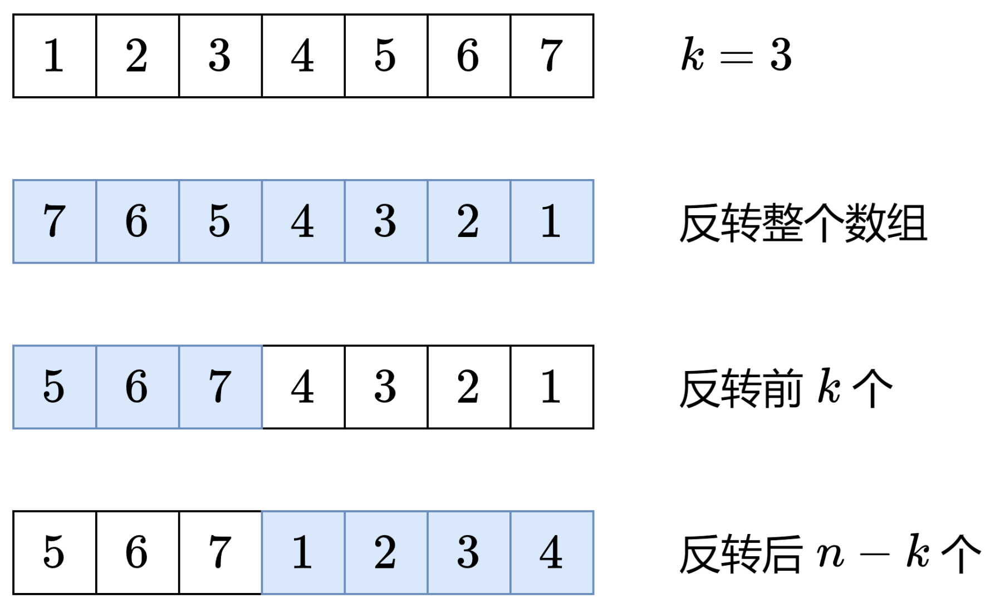

## [456. 132模式](https://leetcode.cn/problems/132-pattern/)

思路：从后往前遍历，维护一个**单调递减**的栈，同时使用 `k` 记录所有出栈元素的最大值。

```c++
class Solution {
public:
    bool find132pattern(vector<int>& nums) 
    {
        // 获取数组大小
        int n = nums.size();
        // 单调栈
        stack<int> stk;
        // 存储 k
        int k = INT_MIN;
        // 利用单调栈使得一直满足 j < k 
        for(int i = n-1; i >= 0; --i)
        {
            // 发现 k > i 的情况直接返回 true
            if(k > nums[i]) return true;
            while(!stk.empty() && stk.top() < nums[i])
            {
                // 贪心，每次挑选尽量大的值作为 k
                k = max(stk.top(), k);
                stk.pop();
            }
            stk.emplace(nums[i]);
        }
        // 没有满足 132 模式的情况
        return false;
    }
};
```

- **时间复杂度：O(n)**
- **空间复杂度：O(n)**

## [189. 轮转数组](https://leetcode.cn/problems/rotate-array/)

思路：



```c++
class Solution {
public:
    void rotate(vector<int>& nums, int k) 
    {
        // 数组大小
        int n = nums.size();
        // 对 k 取模
        k %= n;
        // 整体反转
        reverse(nums.begin(), nums.end());
        // 反转前半部分
        reverse(nums.begin(), nums.begin()+k);
        // 反转后半部分
        reverse(nums.begin()+k, nums.end());
    }
};
```

- **时间复杂度：O(n)**
- **空间复杂度：O(1)**

## [73. 矩阵置零](https://leetcode.cn/problems/set-matrix-zeroes)

思路：使用与行列数量相等的数组记录置零信息。

```c++
class Solution {
public:
    void setZeroes(vector<vector<int>>& matrix) 
    {
        // 行数
        int m = matrix.size();
        // 列数
        int n = matrix[0].size();
        // 记录置零位置
        vector<int> cols(n);
        vector<int> rows(m);
        // 遍历矩阵，寻找置零位置
        for(int i = 0; i < m; ++i)
        {
            for(int j = 0; j < n; ++j)
            {
                if(matrix[i][j] == 0)
                {
                    rows[i] = 1;
                    cols[j] = 1;
                }
            }
        }
        // 遍历矩阵将记录的行和列置零
        for(int i = 0; i < m; ++i)
        {
            for(int j = 0; j < n; ++j)
            {
                if(rows[i] == 1 || cols[j] == 1)
                {
                    matrix[i][j] = 0;
                }
            }
        }
    }
};
```

- **时间复杂度**：**O(m × n)**
- **空间复杂度**：**O(m + n)**

## [238. 除自身以外数组的乘积](https://leetcode.cn/problems/product-of-array-except-self)

`answer[i]` 等于 `nums` 中除了 `nums[i]` 之外其余各元素的乘积。换句话说，如果知道了 `i` 左边所有数的乘积，以及 `i` 右边所有数的乘积，就可以算出 `answer[i]`。

于是：

- 定义 `pre[i]`表示从 `nums[0]` 到 `nums[i−1]` 的乘积。

- 定义 `suf[i]` 表示从 `nums[i+1]` 到 `nums[n−1]` 的乘积。

我们可以先计算出从 `nums[0]` 到 `nums[i−2]` 的乘积 `pre[i−1]`，再乘上 `nums[i−1]`，就得到了 `pre[i]`，即
$$
pre[i]=pre[i−1]⋅nums[i−1]
$$
同理有

$$
suf[i]=suf[i+1]⋅nums[i+1]
$$
初始值：`pre[0]=suf[n−1]=1`。按照上文的定义，`pre[0]` 和 `suf[n−1]` 都是空子数组的元素乘积，我们规定这是 1，因为 1 乘以任何数 `x` 都等于 `x`，这样可以方便递推计算 `pre[1]`，`suf[n−2]` 等。

算出 `pre` 数组和 `suf` 数组后，有

$$
answer[i]=pre[i]⋅suf[i]
$$

```c++
class Solution {
public:
    vector<int> productExceptSelf(vector<int>& nums) 
    {
        int n = nums.size();
        // 前缀乘积（不包含本元素）
        vector<int> preMulti(n, 1);
        // 后缀乘积（不包含本元素）
        vector<int> posMulti(n, 1);
        // 计算前缀乘积
        for(int i = 1; i < n; ++i)
        {
            preMulti[i] = preMulti[i-1]*nums[i-1];
        }
        // 计算后缀乘积
        for(int j = n-2; j >= 0; --j)
        {
            posMulti[j] = posMulti[j+1]*nums[j+1];
        }
        // 结果
        vector<int> ans(n);
        for(int i = 0; i < n; ++i)
        {
            // 前缀乘积 与 后缀乘积相乘
            ans[i] = posMulti[i] * preMulti[i];
        }
        return ans;
    }
};
```

- **时间复杂度**：**O(n)**
- **空间复杂度**：**O(n)**

## [2134. 最少交换次数来组合所有的 1 II](https://leetcode.cn/problems/minimum-swaps-to-group-all-1s-together-ii/)

思路：将问题转化为 **定长滑动窗口内 0 的最小个数**

```c++
class Solution {
public:
    int minSwaps(vector<int>& nums) 
    {
        // 数组大小
        int n = nums.size(), k = 0;
        // 计算 1 的个数（窗口长度）
        for(auto& num : nums)
        {
            if(num == 1) k++;
        }
        // 拼接环形数组
        nums.insert(nums.end(), nums.begin(), nums.begin()+k);

        int ans = INT_MAX;
        // 记录 0 和 1 的个数
        vector<int> hash(2);
        // 利用定长滑动窗口记录窗口中 0 的个数即可
        for(int i = 0; i < nums.size(); ++i)
        {
            // 进入窗口
            hash[nums[i]]++;
            // 小于窗口长度
            if(i < k) continue;
            // 退出窗口
            hash[nums[i-k]]--;
            // 找到 0 最少的窗口
            ans = min(ans, hash[0]);
        }
        return ans;
    }
};
```

- **时间复杂度**：**O(n)**
- **空间复杂度**：**O(n)**

## [1297. 子串的最大出现次数](https://leetcode.cn/problems/maximum-number-of-occurrences-of-a-substring/)

思路：只需统计长度为 minSize 的子串，而不需要统计长度为 maxSize 的字串，因为 "abc" 肯定会覆盖 "a"，"ab"，即长的肯定会覆盖短的，只需要考虑最短的即可。

```c++
class Solution {
public:
    int maxFreq(string s, int maxLetters, int minSize, int maxSize) 
    {
        int n = s.size(), ans = 0;
        // 统计子串出现的次数
        unordered_map<string, int> cnt;
        for(int i = 0; i < n-minSize+1; ++i)
        {
            // 获取子串（定长滑动窗口）
            string subString = s.substr(i, minSize);
            // 利用哈希集合统计不同字母的个数
            unordered_set<int> hash_set(subString.begin(), subString.end());
            // 如果满足不同字母数目小于等于 maxLetters
            if(hash_set.size() <= maxLetters)
            {
                // 当前子串个数++
                cnt[subString]++;
                // 尝试更新最长子串
                ans = max(ans, cnt[subString]);
            }
        }    
        return ans;
    }
};
```

- **时间复杂度**：**O(n*minSize)**
- **空间复杂度**：**O(n*minSize)**
